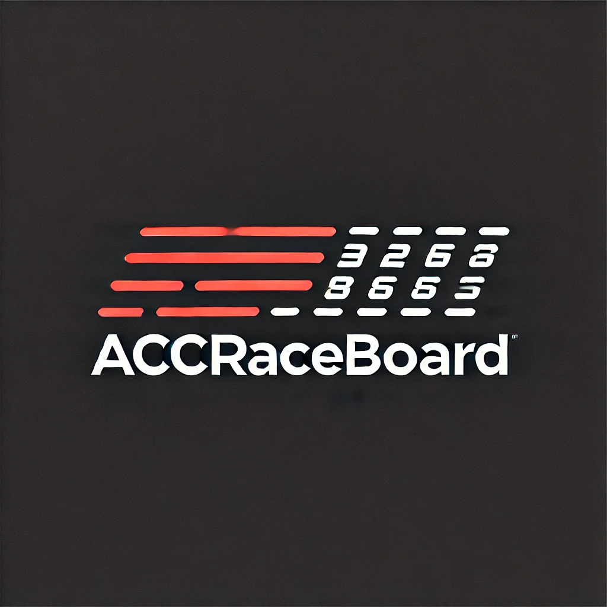
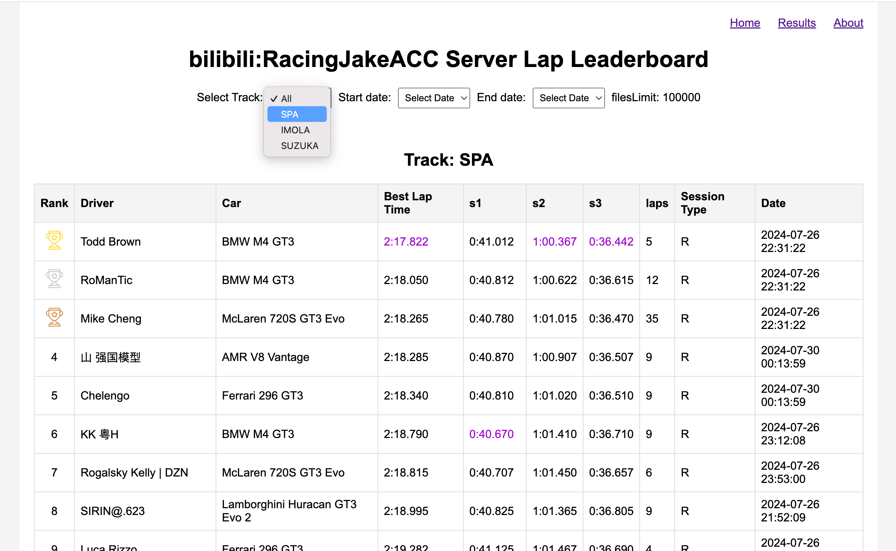
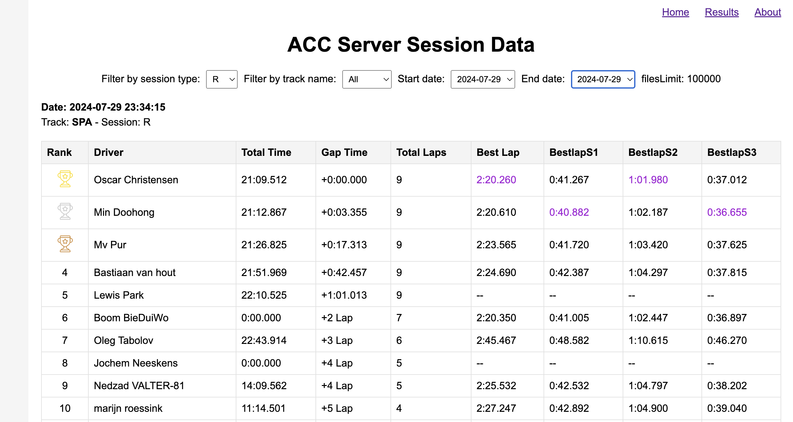

## Introduction


`AccRaceBoard` is a simple web server that displays your ACC server's best lap rankings by different tracks. It also supports viewing race results rankings for individual events.




## Guide
1. Download the `AccRaceBoard.exe` and `config.yaml` from [https://github.com/hjdshu/AccRaceBoard/releases](https://github.com/hjdshu/AccRaceBoard/releases) to your Windows server.
2. Edit the `config.yaml`, except for the "server_path", which should be the path to your ACC server, including a "results" folder. The `config.yaml` file's `files_limit` setting determines the maximum number of JSON files to keep in the results folder; you can set a maximum limit.
3. Enable the "dumpLeaderboards" setting in your ACC server.
4. Run `AccRaceBoard.exe`.
5. Open http://localhost:9543 in your browser. You can also edit the `config.yaml` to change the "port".


## Dev
```
npm install -g pkg
npm install
node app.js
//if u installed nodemon
nodemon app.js
```
## Build 
npm run build

